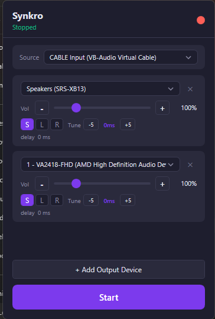

# Synkro

Multi-speaker audio router for Windows. Captures system audio and plays through multiple speakers simultaneously with auto delay compensation, per-device volume/fine-tune, and stereo L/R channel separation.



## Features

- **Multi-output routing** — play system audio through 2+ speakers at the same time
- **Auto delay compensation** — syncs wired and Bluetooth speakers automatically
- **Per-device fine-tune** — adjust timing per speaker (±300ms) for perfect sync
- **Stereo L/R separation** — assign Left or Right channel to individual speakers
- **Volume boost up to 500%** — tanh soft compression, no distortion
- **Source selector** — choose which audio device to capture from (supports VB-Audio Virtual Cable, FxSound, etc.)
- **Format auto-detection** — resamples when capture and output devices use different sample rates
- **Dark theme UI** — clean, minimal interface

## Use case

You have wired speakers + Bluetooth speakers and want them all playing your PC audio in sync. Or you have 2 speakers and want true stereo separation (one plays Left, the other plays Right).

## Requirements

- **Windows 10/11** (64-bit)
- **.NET 8 Desktop Runtime** — [Download here](https://dotnet.microsoft.com/en-us/download/dotnet/8.0) (select ".NET Desktop Runtime" for Windows x64)
- At least **2 audio output devices**

## Quick start

1. Download `Synkro.exe` from [Releases](https://github.com/phatMT97/Synkro/releases)
2. Run the app
3. Select **Source** (the audio device to capture from)
4. Click **+ Add Output Device** for each speaker you want
5. Select the device from the dropdown, adjust volume
6. Click **Start**

## Stereo L/R separation

To split stereo across 2 speakers (one Left, one Right):

1. You need a virtual audio device as the capture source (e.g., [VB-Audio Virtual Cable](https://vb-audio.com/Cable/) — free)
2. Set the virtual device as Windows default output
3. In Synkro, set **Source** = the virtual device
4. Add 2 output devices, set one to **L** and the other to **R**
5. Start — each speaker plays only its assigned channel

Without a virtual device, the capture source always plays native stereo audio (from the OS). L/R filtering only works on output devices routed through Synkro.

## Per-device fine-tune

Auto-delay compensates for Bluetooth vs wired latency differences. If sync still isn't perfect:

- Each device has **-5 / +5** buttons to adjust timing
- If a speaker plays **too early** → increase its fine-tune (+)
- If a speaker plays **too late** → decrease its fine-tune (-)

## Tips

- Close button asks: **Yes** = minimize to tray, **No** = exit
- Right-click tray icon to fully exit
- Volume above 100% uses soft compression — louder without distortion
- Settings (devices, volume, fine-tune, L/R) are saved automatically

## Build from source

```bash
git clone https://github.com/phatMT97/Synkro.git
cd Synkro

# Build
dotnet build MultiSound/Synkro/Synkro.csproj

# Publish (framework-dependent, ~2MB)
dotnet publish MultiSound/Synkro/Synkro.csproj -c Release -r win-x64 -p:SelfContained=false -p:PublishSingleFile=true

# Publish (self-contained, ~157MB)
dotnet publish MultiSound/Synkro/Synkro.csproj -c Release -r win-x64 --self-contained true -p:PublishSingleFile=true -p:IncludeNativeLibrariesForSelfExtract=true
```

## Tech stack

- C# / .NET 8 / WPF
- [NAudio 2.2.1](https://github.com/naudio/NAudio) — WASAPI loopback capture & output

## License

MIT
